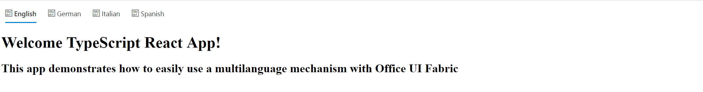

# react-multilanguage-app

## Summary

This app demonstrates how to built a ReactJS multilanguage app.

## Solution

Solution|Author(s)
--------|---------
react-multilanguage-app|Giuliano De Luca ([@giuleon](https://twitter.com/giuleon) , [www.delucagiuliano.com](http://www.delucagiuliano.com))

## Version history

Version|Date|Comments
-------|----|--------
1.0.0|July 28, 2017|Initial release

## Disclaimer
**THIS CODE IS PROVIDED *AS IS* WITHOUT WARRANTY OF ANY KIND, EITHER EXPRESS OR IMPLIED, INCLUDING ANY IMPLIED WARRANTIES OF FITNESS FOR A PARTICULAR PURPOSE, MERCHANTABILITY, OR NON-INFRINGEMENT.**

---

## Minimal Path to Awesome

- clone this repo
- in the command line execute
  - `npm i`

## Features

Sample web part in this solution illustrates the following concepts on top :

- Creating a ReactJS Multi Language App
- using Office UI Fabric React styles for building user experience consistent with SharePoint and Office